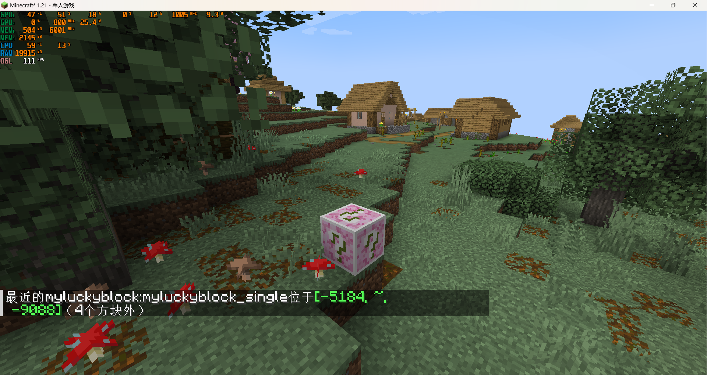

# MyLuckyBlock-BigGlobe-Compat

## 总览Summary
本模组实现了MyLuckyBlock与BigGlobe的兼容，使得MyLuckyBlock的幸运方块可以生成在BigGlobe的世界中。 
This mod implements the compatibility between MyLuckyBlock and BigGlobe, so that MyLuckyBlock's lucky blocks can generate in BigGlobe's world. 

## 依赖Dependencies
| Mod | Version |
| ---- | ---- |
| Minecraft | >= 1.21 |
| MyLuckyBlock(Optional) | >= 1.1.0 |
| BigGlobe(Optional) | *Any*? |